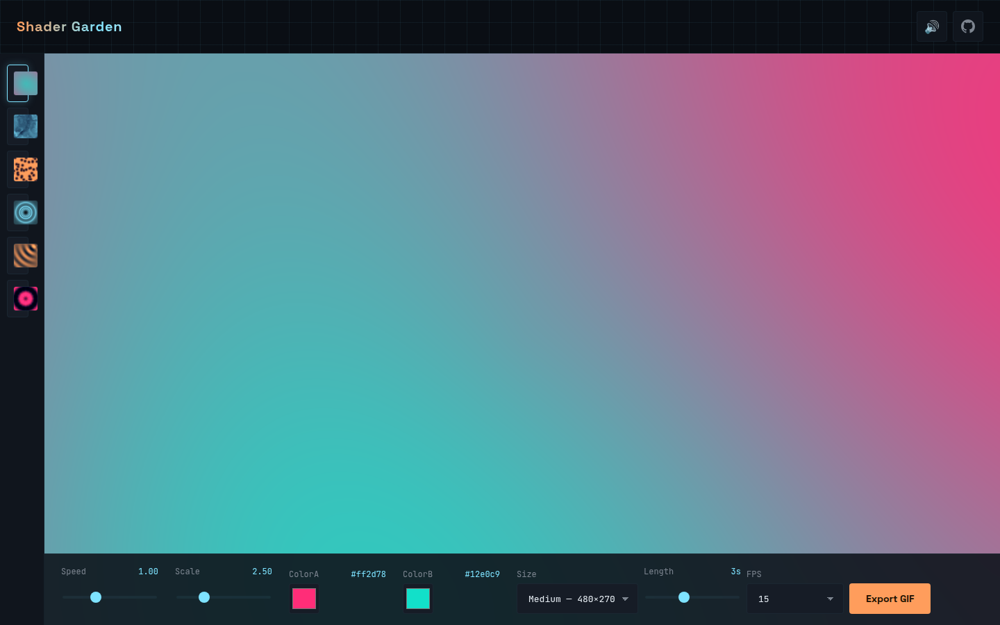

# Shader Garden

**▶ Live demo — [apps.charliekrug.com/shader-garden](https://apps.charliekrug.com/shader-garden/)**

Fork a shader, make a looping GIF.

[](https://github.com/ctkrug/shader-garden/actions/workflows/ci.yml)
[](LICENSE)

Shader Garden is a GLSL playground that runs entirely in your browser. Start from a
hand-written generative-art preset, fork it into an editable copy, and change its code or its
controls while the render updates live. When you like what you see, export it as a looping GIF
and download it. No account, no build step, no server.



## Who it's for

People who know a little JavaScript but not GLSL, and want a real feedback loop for learning
shaders: pick something that already looks good, change one number, watch it respond, and walk
away with a GIF instead of just a browser tab.

## What it does

- **Controls that build themselves.** Every slider and color picker is generated from the
  shader source. Declare a uniform with a trailing hint like `// min:0 max:5 default:1.2` and
  Shader Garden reflects it into a labelled control. Edit the shader and the panel regenerates
  as you type.
- **Six hand-written presets.** Plasma, a domain-warped flow field, voronoi cells, a ray-marched
  tunnel, wave interference, and a kaleidoscope. Each gallery card renders a live thumbnail of
  the shader itself.
- **Fork, don't destroy.** Editing always starts from a copy, so the originals never change and
  resetting is just reselecting a preset. Your fork and its values persist to `localStorage`, so
  a reload picks up where you left off.
- **Errors that don't blank the canvas.** A compile error shows inline and the last working
  frame keeps rendering, so a typo mid-edit never wipes what you were looking at.
- **Client-side GIF export.** Pick a size, length, and frame rate. Shader Garden renders your
  shader off-screen at a fixed cadence, quantizes the frames to a shared 256-color palette, and
  writes a GIF89a file in the browser. Nothing is uploaded anywhere.

## How it's built

- **TypeScript + Vite** for the dev server and a static production build.
- **Raw WebGL2**, no three.js or regl. The pipeline (context setup, program compile and link,
  uniform reflection, render loop) is hand-rolled on purpose. That is the point of the project.
- **A from-scratch GIF89a encoder** (median-cut quantization, variable-width LZW), in keeping
  with the hand-rolled philosophy of the render pipeline.
- **Vitest** for unit tests on the non-GL logic: uniform parsing, the preset registry, GIF frame
  timing, color quantization, and the LZW and GIF89a byte-stream assembly (round-tripped through
  a decoder written in the test file).

## Run it locally

```bash
npm install
npm run dev      # local dev server with hot reload
npm test         # unit tests
npm run build    # static production build into dist/
```

The build is static output only, deployable to a subpath or a domain root with no backend.

## How to use it

1. Click a preset in the gallery rail to load it.
2. Drag the sliders and color swatches in the bottom dock to change its uniforms live.
3. Click the fork button on a card to open the source editor and edit the GLSL directly.
4. Set a size, length, and frame rate, then export a looping GIF.

## Documentation

- [`docs/VISION.md`](docs/VISION.md): why the project exists and its design decisions.
- [`docs/ARCHITECTURE.md`](docs/ARCHITECTURE.md): a map of the code.
- [`docs/DESIGN.md`](docs/DESIGN.md): the visual language.

## License

MIT. See [`LICENSE`](LICENSE).

---

More of Charlie's projects → https://apps.charliekrug.com
</content>
